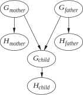
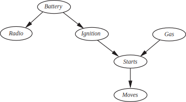
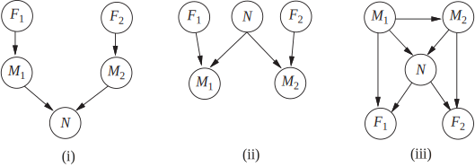
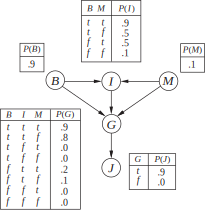

# 14. Probabilistic Reasoning

**14.1** We have a bag of three biased coins $a$, $b$, and $c$ with probabilities
of coming up heads of 20%, 60%, and 80%, respectively. One coin is drawn
randomly from the bag (with equal likelihood of drawing each of the
three coins), and then the coin is flipped three times to generate the
outcomes $X_1$, $X_2$, and $X_3$.

1.  Draw the Bayesian network corresponding to this setup and define the
    necessary CPTs.

2.  Calculate which coin was most likely to have been drawn from the bag
    if the observed flips come out heads twice and tails once.

**14.2** We have a bag of three biased coins $a$, $b$, and $c$ with probabilities
of coming up heads of 30%, 60%, and 75%, respectively. One coin is drawn
randomly from the bag (with equal likelihood of drawing each of the
three coins), and then the coin is flipped three times to generate the
outcomes $X_1$, $X_2$, and $X_3$.

1.  Draw the Bayesian network corresponding to this setup and define the
    necessary CPTs.

2.  Calculate which coin was most likely to have been drawn from the bag
    if the observed flips come out heads twice and tails once.

**14.3** \[cpt-equivalence-exercise\]
Equation ([parameter-joint-repn-equation](#/)) on
page [parameter-joint-repn-equation](#/) defines the joint distribution represented by a
Bayesian network in terms of the parameters
$\theta(X_i{{\,|\,}}{Parents}(X_i))$. This exercise asks you to derive
the equivalence between the parameters and the conditional probabilities
${\textbf{ P}}(X_i{{\,|\,}}{Parents}(X_i))$ from this definition.

1.  Consider a simple network $X\rightarrow Y\rightarrow Z$ with three
    Boolean variables. Use
    Equations ([conditional-probability-equation](#/)) and ([marginalization-equation](#/))
    (pages [conditional-probability-equation](#/) and [marginalization-equation](#/)) 
    to express the conditional probability $P(z{{\,|\,}}y)$ as the ratio of two sums, each over entries in the
    joint distribution ${\textbf{P}}(X,Y,Z)$.

2.  Now use Equation ([parameter-joint-repn-equation](#/)) to
    write this expression in terms of the network parameters
    $\theta(X)$, $\theta(Y{{\,|\,}}X)$, and $\theta(Z{{\,|\,}}Y)$.

3.  Next, expand out the summations in your expression from part (b),
    writing out explicitly the terms for the true and false values of
    each summed variable. Assuming that all network parameters satisfy
    the constraint
    $\sum_{x_i} \theta(x_i{{\,|\,}}{parents}(X_i)){{\,{=}\,}}1$, show
    that the resulting expression reduces to $\theta(z{{\,|\,}}y)$.

4.  Generalize this derivation to show that
    $\theta(X_i{{\,|\,}}{Parents}(X_i)) = {\textbf{P}}(X_i{{\,|\,}}{Parents}(X_i))$
    for any Bayesian network.

**14.4** The **arc reversal** operation of in a Bayesian network allows us to change the direction
of an arc $X\rightarrow Y$ while preserving the joint probability
distribution that the network represents @Shachter:1986. Arc reversal
may require introducing new arcs: all the parents of $X$ also become
parents of $Y$, and all parents of $Y$ also become parents of $X$.

1.  Assume that $X$ and $Y$ start with $m$ and $n$ parents,
    respectively, and that all variables have $k$ values. By calculating
    the change in size for the CPTs of $X$ and $Y$, show that the total
    number of parameters in the network cannot decrease during
    arc reversal. (*Hint*: the parents of $X$ and $Y$ need
    not be disjoint.)

2.  Under what circumstances can the total number remain constant?

3.  Let the parents of $X$ be $\textbf{U} \cup \textbf{V}$ and the parents of $Y$ be
    $\textbf{V} \cup \textbf{W}$, where $\textbf{U}$ and $\textbf{W}$ are disjoint. The formulas for the
    new CPTs after arc reversal are as follows: $$\begin{aligned}
    {\textbf{P}}(Y{{\,|\,}}\textbf{U},\textbf{V},\textbf{W}) &=& \sum_x {\textbf{P}}(Y{{\,|\,}}\textbf{V},\textbf{W}, x) {\textbf{P}}(x{{\,|\,}}\textbf{U}, \textbf{V}) \\
    {\textbf{P}}(X{{\,|\,}}\textbf{U},\textbf{V},\textbf{W}, Y) &=& {\textbf{P}}(Y{{\,|\,}}X, \textbf{V}, \textbf{W}) {\textbf{P}}(X{{\,|\,}}\textbf{U}, \textbf{V}) / {\textbf{P}}(Y{{\,|\,}}\textbf{U},\textbf{V},\textbf{W})\ .\end{aligned}$$
    Prove that the new network expresses the same joint distribution
    over all variables as the original network.

**14.5** Consider the Bayesian network in
Figure [burglary-figure](#/).

1.  If no evidence is observed, are ${Burglary}$ and ${Earthquake}$
    independent? Prove this from the numerical semantics and from the
    topological semantics.

2.  If we observe ${Alarm}{{\,{=}\,}}{true}$, are ${Burglary}$ and
    ${Earthquake}$ independent? Justify your answer by calculating
    whether the probabilities involved satisfy the definition of
    conditional independence.

**14.6** Suppose that in a Bayesian network containing an unobserved variable
$Y$, all the variables in the Markov blanket ${MB}(Y)$ have been
observed.

1.  Prove that removing the node $Y$ from the network will not affect
    the posterior distribution for any other unobserved variable in
    the network.

2.  Discuss whether we can remove $Y$ if we are planning to use (i)
    rejection sampling and (ii) likelihood weighting.

<b id="handedness-figure">Figure [handedness-figure](#handedness-figure)</b> Three possible structures for a Bayesian network describing genetic inheritance of handedness.

    
**14.7** \[handedness-exercise\] Let $H_x$ be a random variable denoting the
handedness of an individual $x$, with possible values $l$ or $r$. A
common hypothesis is that left- or right-handedness is inherited by a
simple mechanism; that is, perhaps there is a gene $G_x$, also with
values $l$ or $r$, and perhaps actual handedness turns out mostly the
same (with some probability $s$) as the gene an individual possesses.
Furthermore, perhaps the gene itself is equally likely to be inherited
from either of an individual’s parents, with a small nonzero probability
$m$ of a random mutation flipping the handedness.

1.  Which of the three networks in
    Figure [handedness-figure](#handedness-figure) claim that
    $ {\textbf{P}}(G_{{father}},G_{{mother}},G_{{child}}) = {\textbf{P}}(G_{{father}}){\textbf{P}}(G_{{mother}}){\textbf{P}}(G_{{child}})$?

2.  Which of the three networks make independence claims that are
    consistent with the hypothesis about the inheritance of handedness?

3.  Which of the three networks is the best description of the
    hypothesis?

4.  Write down the CPT for the $G_{{child}}$ node in network (a), in
    terms of $s$ and $m$.

5.  Suppose that
    $P(G_{{father}}{{\,{=}\,}}l)=P(G_{{mother}}{{\,{=}\,}}l)=q$. In
    network (a), derive an expression for $P(G_{{child}}{{\,{=}\,}}l)$
    in terms of $m$ and $q$ only, by conditioning on its parent nodes.

6.  Under conditions of genetic equilibrium, we expect the distribution
    of genes to be the same across generations. Use this to calculate
    the value of $q$, and, given what you know about handedness in
    humans, explain why the hypothesis described at the beginning of
    this question must be wrong.

**14.8** \[markov-blanket-exercise\] The **Markov
blanket** of a variable is defined on page [markov-blanket-page](#/).
Prove that a variable is independent of all other variables in the
network, given its Markov blanket and derive
Equation ([markov-blanket-equation](#/))
(page [markov-blanket-equation](#/)).

<b id="car-starts-figure">Figure [car-starts-figure](#car-starts-figure)</b> A Bayesian network describing some features of a car's electrical system and engine. Each variable is Boolean, and the *true* value indicates that the corresponding aspect of the vehicle is in working order.

**14.9** Consider the network for car diagnosis shown in
Figure [car-starts-figure](#car-starts-figure).

1.  Extend the network with the Boolean variables ${IcyWeather}$ and
    ${StarterMotor}$.

2.  Give reasonable conditional probability tables for all the nodes.

3.  How many independent values are contained in the joint probability
    distribution for eight Boolean nodes, assuming that no conditional
    independence relations are known to hold among them?

4.  How many independent probability values do your network tables
    contain?

5.  The conditional distribution for ${Starts}$ could be described as
    a **noisy-AND** distribution. Define this
    family in general and relate it to the noisy-OR distribution.

**14.10** Consider a simple Bayesian network with root variables ${Cold}$,
${Flu}$, and ${Malaria}$ and child variable ${Fever}$, with a
noisy-OR conditional distribution for ${Fever}$ as described in
Section [canonical-distribution-section](#/). By adding
appropriate auxiliary variables for inhibition events and fever-inducing
events, construct an equivalent Bayesian network whose CPTs (except for
root variables) are deterministic. Define the CPTs and prove
equivalence.

**14.11** \[LG-exercise\] Consider the family of linear Gaussian networks, as
defined on page [LG-network-page](#/).

1.  In a two-variable network, let $X_1$ be the parent of $X_2$, let
    $X_1$ have a Gaussian prior, and let
    ${\textbf{P}}(X_2{{\,|\,}}X_1)$ be a linear
    Gaussian distribution. Show that the joint distribution $P(X_1,X_2)$
    is a multivariate Gaussian, and calculate its covariance matrix.

2.  Prove by induction that the joint distribution for a general linear
    Gaussian network on $X_1,\ldots,X_n$ is also a
    multivariate Gaussian.

**14.12** \[multivalued-probit-exercise\] The probit distribution defined on
page [probit-page](#/) describes the probability distribution for a Boolean
child, given a single continuous parent.

1.  How might the definition be extended to cover multiple continuous
    parents?

2.  How might it be extended to handle a *multivalued*
    child variable? Consider both cases where the child’s values are
    ordered (as in selecting a gear while driving, depending on speed,
    slope, desired acceleration, etc.) and cases where they are
    unordered (as in selecting bus, train, or car to get to work).
    (*Hint*: Consider ways to divide the possible values
    into two sets, to mimic a Boolean variable.)

**14.13** In your local nuclear power station, there is an alarm that senses when
a temperature gauge exceeds a given threshold. The gauge measures the
temperature of the core. Consider the Boolean variables $A$ (alarm
sounds), $F_A$ (alarm is faulty), and $F_G$ (gauge is faulty) and the
multivalued nodes $G$ (gauge reading) and $T$ (actual core temperature).

1.  Draw a Bayesian network for this domain, given that the gauge is
    more likely to fail when the core temperature gets too high.

2.  Is your network a polytree? Why or why not?

3.  Suppose there are just two possible actual and measured
    temperatures, normal and high; the probability that the gauge gives
    the correct temperature is $x$ when it is working, but $y$ when it
    is faulty. Give the conditional probability table associated with
    $G$.

4.  Suppose the alarm works correctly unless it is faulty, in which case
    it never sounds. Give the conditional probability table associated
    with $A$.

5.  Suppose the alarm and gauge are working and the alarm sounds.
    Calculate an expression for the probability that the temperature of
    the core is too high, in terms of the various conditional
    probabilities in the network.

**14.14** \[telescope-exercise\] Two astronomers in different parts of the world
make measurements $M_1$ and $M_2$ of the number of stars $N$ in some
small region of the sky, using their telescopes. Normally, there is a
small possibility $e$ of error by up to one star in each direction. Each
telescope can also (with a much smaller probability $f$) be badly out of
focus (events $F_1$ and $F_2$), in which case the scientist will
undercount by three or more stars (or if $N$ is less than 3, fail to
detect any stars at all). Consider the three networks shown in
Figure [telescope-nets-figure](#telescope-nets-figure).

1.  Which of these Bayesian networks are correct (but not
    necessarily efficient) representations of the preceding information?

2.  Which is the best network? Explain.

3.  Write out a conditional distribution for
    ${\textbf{P}}(M_1{{\,|\,}}N)$, for the case where
    $N{{\,{\in}\,}}\{1,2,3\}$ and $M_1{{\,{\in}\,}}\{0,1,2,3,4\}$. Each
    entry in the conditional distribution should be expressed as a
    function of the parameters $e$ and/or $f$.

4.  Suppose $M_1{{\,{=}\,}}1$ and $M_2{{\,{=}\,}}3$. What are the
    *possible* numbers of stars if you assume no prior
    constraint on the values of $N$?

5.  What is the *most likely* number of stars, given these
    observations? Explain how to compute this, or if it is not possible
    to compute, explain what additional information is needed and how it
    would affect the result.

**14.15** Consider the network shown in
Figure [telescope-nets-figure](#telescope-nets-figure)(ii), and assume that the
two telescopes work identically. $N{{\,{\in}\,}}\{1,2,3\}$ and
$M_1,M_2{{\,{\in}\,}}\{0,1,2,3,4\}$, with the symbolic CPTs as described
in Exercise [telescope-exercise](#/). Using the enumeration
algorithm (Figure [enumeration-algorithm](#/) on
page [enumeration-algorithm](#/)), calculate the probability distribution
${\textbf{P}}(N{{\,|\,}}M_1{{\,{=}\,}}2,M_2{{\,{=}\,}}2)$.

<b id="telescope-nets-figure">Figure [telescope-nets-figure](#telescope-nets-figure)</b> Three possible networks for the telescope problem.

<b id="politics-figure">Figure [politics-figure](#politics-figure)</b> A simple Bayes net with
Boolean variables B = {BrokeElectionLaw}, I = {Indicted}, M = {PoliticallyMotivatedProsecutor}, G= {FoundGuilty}, J = {Jailed}.

**14.16** Consider the Bayes net shown in Figure [politics-figure](#politics-figure).

1.  Which of the following are asserted by the network
    *structure*?

    1.  ${\textbf{P}}(B,I,M) = {\textbf{P}}(B){\textbf{P}}(I){\textbf{P}}(M)$.

    2.  ${\textbf{P}}(J{{\,|\,}}G) = {\textbf{P}}(J{{\,|\,}}G,I)$.

    3.  ${\textbf{P}}(M{{\,|\,}}G,B,I) = {\textbf{P}}(M{{\,|\,}}G,B,I,J)$.

2.  Calculate the value of $P(b,i,\lnot m,g,j)$.

3.  Calculate the probability that someone goes to jail given that they
    broke the law, have been indicted, and face a politically
    motivated prosecutor.

4.  A **context-specific independence** (see
    page [CSI-page](#/)) allows a variable to be independent of some of
    its parents given certain values of others. In addition to the usual
    conditional independences given by the graph structure, what
    context-specific independences exist in the Bayes net in
    Figure [politics-figure](#politics-figure)?

5.  Suppose we want to add the variable
    $P{{\,{=}\,}}{PresidentialPardon}$ to the network; draw the new
    network and briefly explain any links you add.

**14.17** Consider the Bayes net shown in Figure [politics-figure](#politics-figure).

1.  Which, if any, of the following are asserted by the network
    *structure* (ignoring the CPTs for now)?

    1.  ${\textbf{P}}(B,I,M) = {\textbf{P}}(B){\textbf{P}}(I){\textbf{P}}(M)$.

    2.  ${\textbf{P}}(J{{\,|\,}}G) = {\textbf{P}}(J{{\,|\,}}G,I)$.

    3.  ${\textbf{P}}(M{{\,|\,}}G,B,I) = {\textbf{P}}(M{{\,|\,}}G,B,I,J)$.

2.  Calculate the value of $P(b,i,m,\lnot g,j)$.

3.  Calculate the probability that someone goes to jail given that they
    broke the law, have been indicted, and face a politically
    motivated prosecutor.

4.  A **context-specific independence** (see
    page [CSI-page](#/)) allows a variable to be independent of some of
    its parents given certain values of others. In addition to the usual
    conditional independences given by the graph structure, what
    context-specific independences exist in the Bayes net in
    Figure [politics-figure](#politics-figure)?

5.  Suppose we want to add the variable
    $P{{\,{=}\,}}{PresidentialPardon}$ to the network; draw the new
    network and briefly explain any links you add.

**14.18** \[VE-exercise\] Consider the variable elimination algorithm in
Figure [elimination-ask-algorithm](#/) (page [elimination-ask-algorithm](#/)).

1.  Section [exact-inference-section](#/) applies variable
    elimination to the query
    $${\textbf{P}}({Burglary}{{\,|\,}}{JohnCalls}{{\,{=}\,}}{true},{MaryCalls}{{\,{=}\,}}{true})\ .$$
    Perform the calculations indicated and check that the answer
    is correct.

2.  Count the number of arithmetic operations performed, and compare it
    with the number performed by the enumeration algorithm.

3.  Suppose a network has the form of a *chain*: a sequence
    of Boolean variables $X_1,\ldots, X_n$ where
    ${Parents}(X_i){{\,{=}\,}}\{X_{i-1}\}$ for $i{{\,{=}\,}}2,\ldots,n$.
    What is the complexity of computing
    ${\textbf{P}}(X_1{{\,|\,}}X_n{{\,{=}\,}}{true})$ using
    enumeration? Using variable elimination?

4.  Prove that the complexity of running variable elimination on a
    polytree network is linear in the size of the tree for any variable
    ordering consistent with the network structure.

**14.19** \[bn-complexity-exercise\] Investigate the complexity of exact inference
in general Bayesian networks:

1.  Prove that any 3-SAT problem can be reduced to exact inference in a
    Bayesian network constructed to represent the particular problem and
    hence that exact inference is NP-hard. (*Hint*:
    Consider a network with one variable for each proposition symbol,
    one for each clause, and one for the conjunction of clauses.)

2.  The problem of counting the number of satisfying assignments for a
    3-SAT problem is \#P-complete. Show that exact inference is at least
    as hard as this.

**14.20** \[primitive-sampling-exercise\] Consider the problem of generating a
random sample from a specified distribution on a single variable. Assume
you have a random number generator that returns a random number
uniformly distributed between 0 and 1.

1.  Let $X$ be a discrete variable with
    $P(X{{\,{=}\,}}x_i){{\,{=}\,}}p_i$ for
    $i{{\,{\in}\,}}\{1,\ldots,k\}$. The **cumulative distribution** of $X$ gives the probability
    that $X{{\,{\in}\,}}\{x_1,\ldots,x_j\}$ for each possible $j$. (See
    also Appendix [math-appendix].) Explain how to
    calculate the cumulative distribution in $O(k)$ time and how to
    generate a single sample of $X$ from it. Can the latter be done in
    less than $O(k)$ time?

2.  Now suppose we want to generate $N$ samples of $X$, where $N\gg k$.
    Explain how to do this with an expected run time per sample that is
    *constant* (i.e., independent of $k$).

3.  Now consider a continuous-valued variable with a parameterized
    distribution (e.g., Gaussian). How can samples be generated from
    such a distribution?

4.  Suppose you want to query a continuous-valued variable and you are
    using a sampling algorithm such as LIKELIHOODWEIGHTING to do the inference. How would
    you have to modify the query-answering process?

**14.21** Consider the query
${\textbf{P}}({Rain}{{\,|\,}}{Sprinkler}{{\,{=}\,}}{true},{WetGrass}{{\,{=}\,}}{true})$
in Figure [rain-clustering-figure](#/)(a)
(page [rain-clustering-figure](#/)) and how Gibbs sampling can answer it.

1.  How many states does the Markov chain have?

2.  Calculate the **transition matrix**
    ${\textbf{Q}}$ containing
    $q({\textbf{y}} \rightarrow {{\textbf{y}}'})$
    for all ${\textbf{y}}$, ${\textbf{y}}'$.

3.  What does ${\textbf{ Q}}^2$, the square of the
    transition matrix, represent?

4.  What about ${\textbf{Q}}^n$ as $n\to \infty$?

5.  Explain how to do probabilistic inference in Bayesian networks,
    assuming that ${\textbf{Q}}^n$ is available. Is this a
    practical way to do inference?

**14.22** \[gibbs-proof-exercise\] This exercise explores the stationary
distribution for Gibbs sampling methods.

1.  The convex composition $[\alpha, q_1; 1-\alpha, q_2]$ of $q_1$ and
    $q_2$ is a transition probability distribution that first chooses
    one of $q_1$ and $q_2$ with probabilities $\alpha$ and $1-\alpha$,
    respectively, and then applies whichever is chosen. Prove that if
    $q_1$ and $q_2$ are in detailed balance with $\pi$, then their
    convex composition is also in detailed balance with $\pi$.
    (*Note*: this result justifies a variant of GIBBS-ASK in which
    variables are chosen at random rather than sampled in a
    fixed sequence.)

2.  Prove that if each of $q_1$ and $q_2$ has $\pi$ as its stationary
    distribution, then the sequential composition
    $q {{\,{=}\,}}q_1 \circ q_2$ also has $\pi$ as its
    stationary distribution.

**14.23** \[MH-exercise\] The **Metropolis--Hastings** algorithm is a member of the MCMC family; as such,
it is designed to generate samples $\textbf{x}$ (eventually) according to target
probabilities $\pi(\textbf{x})$. (Typically we are interested in sampling from
$\pi(\textbf{x}){{\,{=}\,}}P(\textbf{x}{{\,|\,}}\textbf{e})$.) Like simulated annealing,
Metropolis–Hastings operates in two stages. First, it samples a new
state $\textbf{x'}$ from a **proposal distribution** $q(\textbf{x'}{{\,|\,}}\textbf{x})$, given the current state $\textbf{x}$.
Then, it probabilistically accepts or rejects $\textbf{x'}$ according to the **acceptance probability**
$$\alpha(\textbf{x'}{{\,|\,}}\textbf{x}) = \min\ \left(1,\frac{\pi(\textbf{x'})q(\textbf{x}{{\,|\,}}\textbf{x'})}{\pi(\textbf{x})q(\textbf{x'}{{\,|\,}}\textbf{x})}  \right)\ .$$
If the proposal is rejected, the state remains at $\textbf{x}$.

1.  Consider an ordinary Gibbs sampling step for a specific variable
    $X_i$. Show that this step, considered as a proposal, is guaranteed
    to be accepted by Metropolis–Hastings. (Hence, Gibbs sampling is a
    special case of Metropolis–Hastings.)

2.  Show that the two-step process above, viewed as a transition
    probability distribution, is in detailed balance with $\pi$.

**14.24** \[soccer-rpm-exercise\]Three soccer teams $A$, $B$, and $C$, play each
other once. Each match is between two teams, and can be won, drawn, or
lost. Each team has a fixed, unknown degree of quality—an integer
ranging from 0 to 3—and the outcome of a match depends probabilistically
on the difference in quality between the two teams.

1.  Construct a relational probability model to describe this domain,
    and suggest numerical values for all the necessary
    probability distributions.

2.  Construct the equivalent Bayesian network for the three matches.

3.  Suppose that in the first two matches $A$ beats $B$ and draws with
    $C$. Using an exact inference algorithm of your choice, compute the
    posterior distribution for the outcome of the third match.

4.  Suppose there are $n$ teams in the league and we have the results
    for all but the last match. How does the complexity of predicting
    the last game vary with $n$?

5.  Investigate the application of MCMC to this problem. How quickly
    does it converge in practice and how well does it scale?

